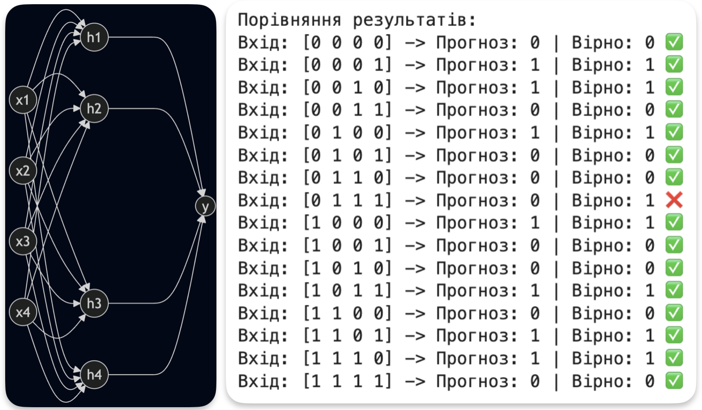
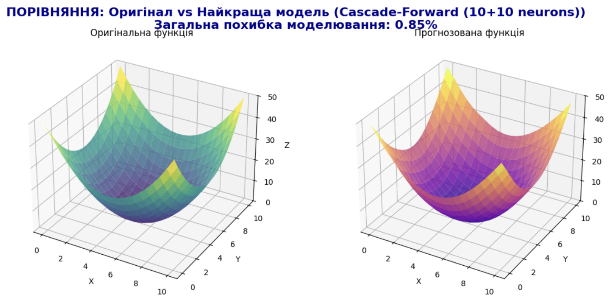
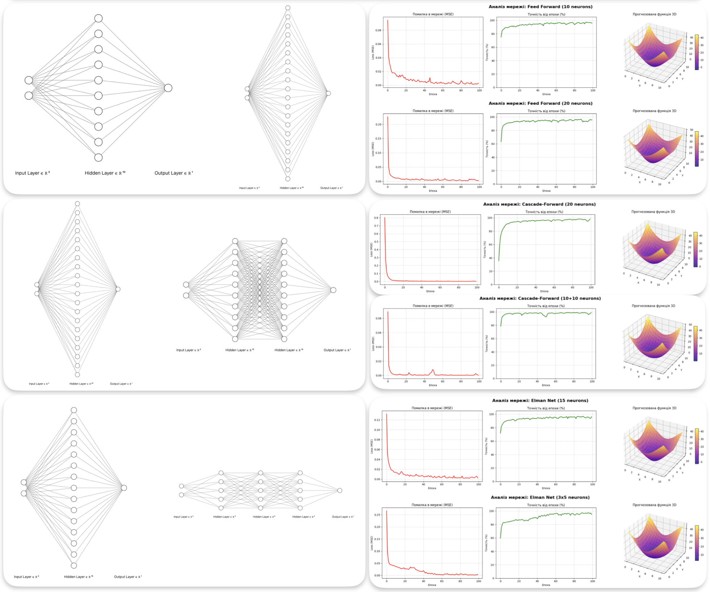
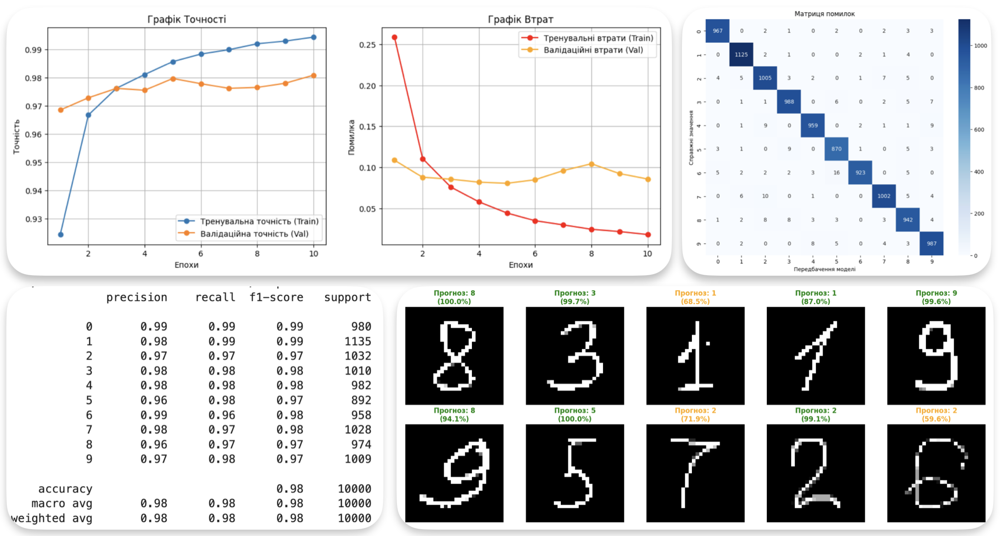
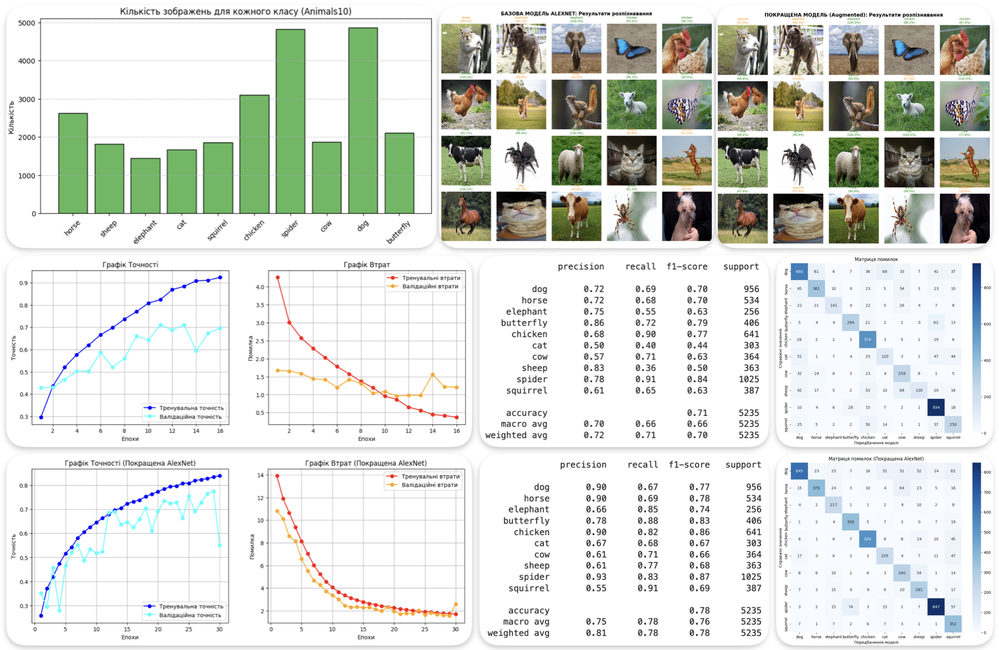
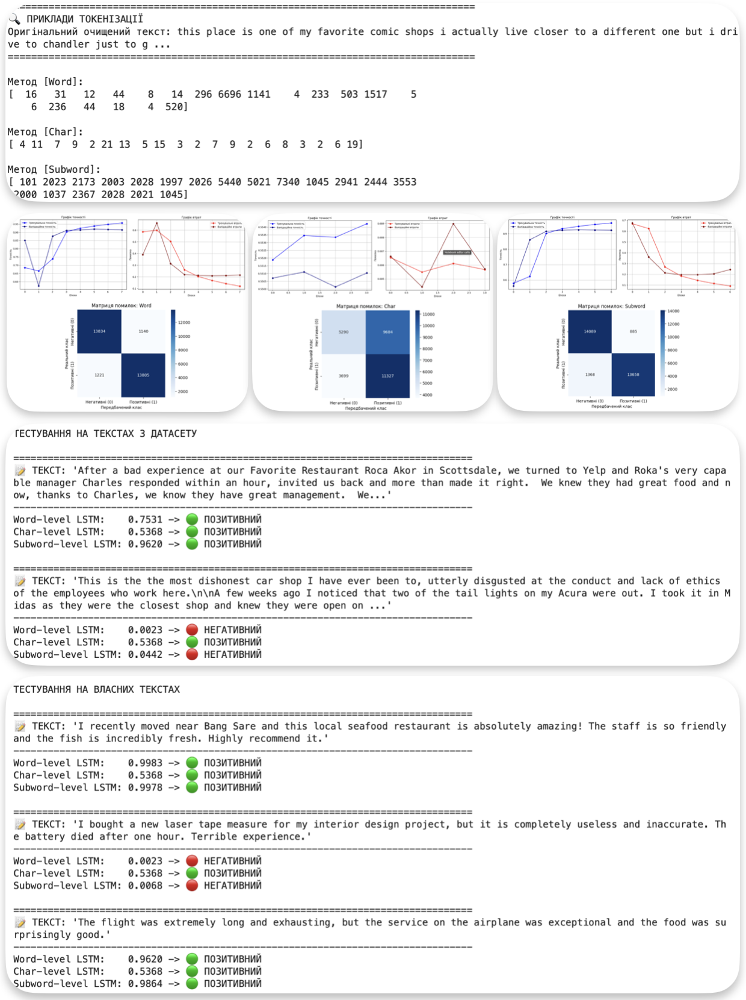
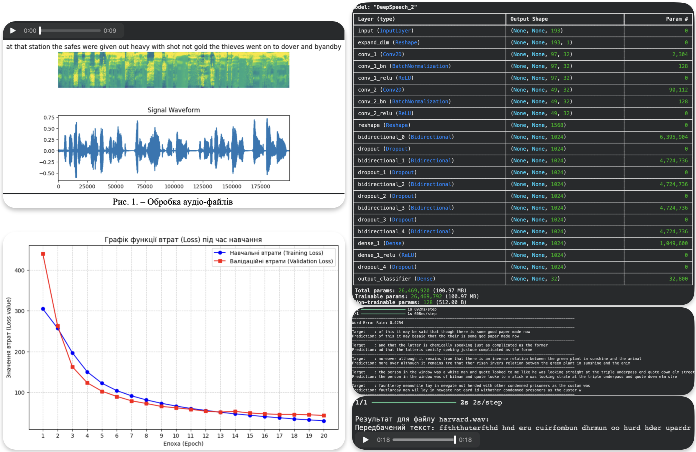

# Проектування та дослідження програмних систем зі штучним інтелектом

Цей репозиторій містить колекцію звітів з лабораторних робіт, виконаних у рамках курсу з дисципліни «Проектування та дослідження програмних систем зі штучним інтелектом».

Усі моделі, експерименти та обробка датасетів проводились переважно у середовищі **Kaggle** (і **Google Colab**).

---

## Стек технологій
* **Мова програмування:** Python
* **Фреймворки:** TensorFlow, Keras
* **Обробка даних та візуалізація:** NumPy, Pandas, Matplotlib, OpenCV
* **Інструменти:** Git, Google Colab, Kaggle, Roboflow

---

## Зміст репозиторію

### 1. [Реалізація нейронної мережі Перцептрон](./ІК-51мп_ПрДПСШІ_Яковенко_ЛР1.pdf)
##### [Посилання на Kaggle](https://www.kaggle.com/code/darrriax/lab1ai)
Побудова одношарового перцептрона для обчислення логічної функції XOR для чотирьох змінних. Робота демонструє розуміння базових принципів навчання: налаштування ваг, порогів активації (bias) та оновлення параметрів.
* **Основи нейромереж, математика ML**

### 2. [Базові архітектури нейромереж для моделювання функцій](./ІК-51мп_ПрДПСШІ_Яковенко_ЛР2.pdf)
##### [Посилання на Kaggle](https://www.kaggle.com/code/darrriax/lab2ai)
Апроксимація нелінійної функції двох змінних ($f(x,y)=x^2+y^2$). Проведено порівняльний експеримент трьох архітектур: Feed Forward, Cascade-Forward та Elman Net на 100 епохах навчання.
* **Робота з Keras, порівняльний аналіз архітектур**

### 3. [Мережі прямого поширення для розпізнавання зображень](./ІК-51мп_ПрДПСШІ_Яковенко_ЛР3.pdf)
##### [Посилання на Kaggle](https://www.kaggle.com/code/darrriax/lab3ai)
Розв'язання задачі комп'ютерного зору — класифікація рукописних цифр на базі датасету MNIST. Включає весь пайплайн: від попередньої обробки «сирих» даних до тестування на власних, написаних від руки цифрах. Загальна точність моделі склала понад 98%.
* **Computer Vision, Data Preprocessing, Confusion Matrix**

### 4. [Згорткові нейронні мережі (CNN) та архітектура AlexNet](./ІК-51мп_ПрДПСШІ_Яковенко_ЛР4.pdf)
##### [Посилання на Kaggle](https://www.kaggle.com/code/darrriax/lab4ai)
Мультикласова класифікація об'єктів на базі датасету Animals10. Практичне дослідження архітектури AlexNet. Використано механізми локальних рецептивних полів та Dropout для боротьби з перенавчанням.
* **CNN, Image Classification, боротьба з Overfitting**

### 5. Архітектура Xception для розпізнавання об'єктів
##### [Посилання на Kaggle](https://www.kaggle.com/code/darrriax/lab5ai1)
Класифікація зображень для розпізнавання автомобільного логотипу Toyota. Згенеровано власний датасет (4000 зображень) із застосуванням динамічної аугментації. Розроблено та навчено глибоку нейромережу на базі архітектури Xception (точність 87%). Проведено тестування моделі на реальному відео.

* **Computer Vision, CNN, Xception, Data Augmentation**

### 6. [Рекурентні нейронні мережі (LSTM) для обробки природної мови](./ІК-51мп_ПрДПСШІ_Яковенко_ЛР6.pdf)
##### [Посилання на Kaggle](https://www.kaggle.com/code/darrriax/lab6ai)
Бінарна класифікація тексту (аналіз тональності відгуків) на базі Yelp Review Polarity. Проведено порівняння трьох методів токенізації: Word-level, Character-level та Subword-level, з точністю понад 92% для найкращого методу.
* **NLP, RNN, LSTM, Tokenization, Text Classification**

### 7. [Гібридні мережі (CNN-bi-LSTM) для розпізнавання мовлення](./ІК-51мп_ПрДПСШІ_Яковенко_ЛР7.pdf)
##### [Посилання на Kaggle](https://www.kaggle.com/code/darrriax/lab7ai)
Побудова акустичної моделі (Speech-to-Text) за мотивами сучасної архітектури DeepSpeech2. Мережа поєднує згортковий блок для вилучення ознак з аудіо та рекурентний блок (bi-LSTM) для аналізу послідовностей у часі. Навчання проводилось з використанням CTC Loss.
* **Speech Recognition, Audio Processing, Hybrid Architectures, CTC Loss**

### 8. Детекція автомобілів з висоти пташиного польоту
##### [Посилання на Kaggle](https://www.kaggle.com/code/darrriax/mkrwork)
Розробка системи комп'ютерного зору для розпізнавання об'єктів на відеокадрах з дрона. Робота охоплює повний цикл: самостійний збір і розмітку датасету, застосування методів просторової та кольорової аугментації, тренування моделі архітектури YOLO11m та створення конвеєра для автоматизованого пакетного опрацювання відеопотоків.
* **Object Detection, YOLOv11, Computer Vision, Albumentations, Data Augmentation, Video Processing**

